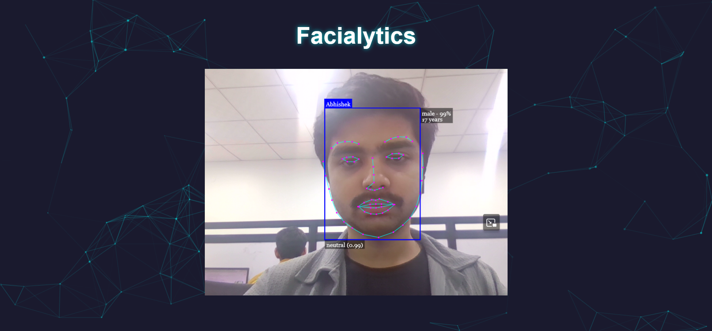
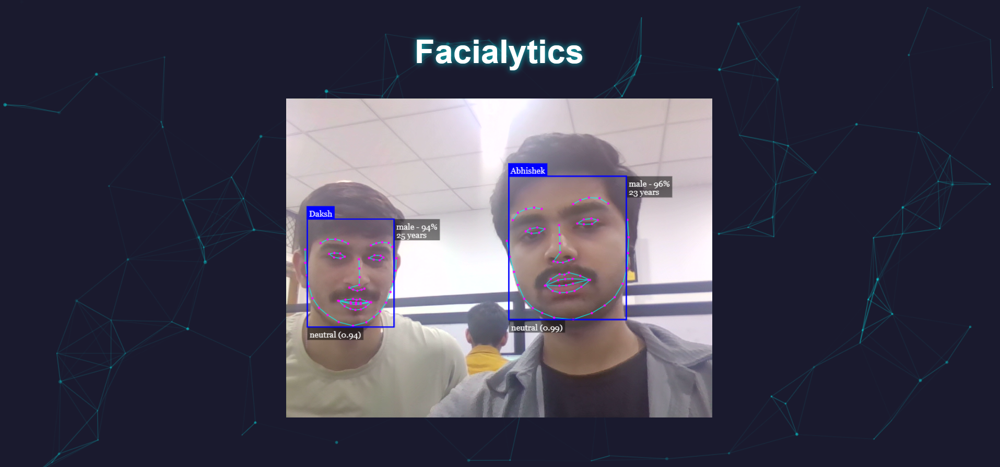
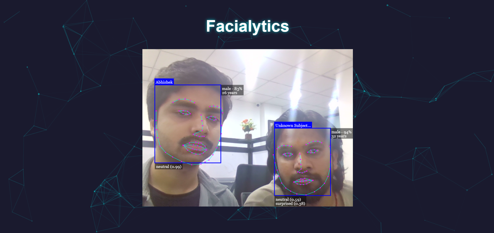

# 🎭 Facialytics (Facial Recognition & Expression Detection System)

A powerful facial recognition and expression detection web app built with **Node.js**, **Express**, and **face-api.js**. The system detects faces in real-time, identifies facial expressions, and matches them against a set of locally stored images.

## 🚀 Features

- ✨ Built with `face-api.js`, a powerful deep learning library
- 🔍 Real-time face detection using **Webcam Video Feed**  or **Uploaded Image**
- 📈 Continuous facial data updates every 200ms  
- 😃 Facial expression recognition (happy, sad, angry, etc.)
- 🧠 Face matching with local image dataset
- 🔐 Local **HTTPS server** via mkcert for secure webcam access
- 🎯 Match live faces with known individuals using **FaceMatcher**  
- 🎨 Clean and minimal UI for optimal focus on detection output  
---

## 📸 Preview

### 🏠 Real-Time Face Recognition – Home Page


---

### 🧑‍💼 Known Person Recognition Demo



---

### 👥 Multiple User Recognition Demo



---

### 🕵️‍♂️ Unknown User Identification Demo



---

## 🛠️ Tech Stack


| Technology   | Description                                |
|--------------|--------------------------------------------|
| Node.js      | Backend JavaScript runtime                 |
| Express      | Web framework for Node.js                  |
| face-api.js  | JavaScript API for face detection          |
| mkcert       | Local HTTPS certificate generation tool    |
| HTML/CSS     | Frontend structure and styling             |
| JavaScript   | Frontend interactivity and logic           |


---
## 📁 Project Structure

<pre>

Facialytics/
├── assets/                          # Media assets (images for documentation/screenshots)
│   ├── homepage.png                 # Screenshot of the homepage
│   ├── multiuserrecognition.png     # Screenshot showing multiple users recognized
│   ├── personrecognition.png        # Screenshot of individual user recognition
│   └── unknownuseridentification.png # Screenshot showing unknown user detection
├── certs/                           # SSL certificates or related files
├── node_modules/                    # Node.js dependencies (auto-generated)
├── public/                          # Static assets (CSS, JS, images, models, etc.)
│   ├── images/                      # Folder containing sample/user images
│   ├── models/                      # Pre-trained face-api.js models
│   ├── face-api.min.js              # Face API library for facial recognition
│   ├── index.html                   # Main frontend HTML file
│   └── scripts.js                   # JavaScript logic for facial recognition
├── .env                             # Environment variables file
├── .gitignore                       # Git ignore rules
├── package-lock.json                # Auto-generated lock file for dependencies
├── package.json                     # Project metadata and dependencies
├── README.md                        # Project documentation
└── server.js                        # Main server file

</pre>

---

## 🧑‍💻 Getting Started

# 1️⃣ Clone the Repository

```bash
git clone https://github.com/yourusername/facialytics.git
cd facialytics

# 2️⃣ Install Dependencies

npm install


# 3️⃣ Setup HTTPS Certificates (Local)
Generate local certificates using mkcert:   

mkcert localhost

Place localhost.pem and localhost-key.pem in the root directory.


# 4️⃣ Start the Server

node server.js

Visit: https://localhost:5000

⚠️ Webcam access requires HTTPS to function in most browsers.

--- 

🔬 How It Works
Captures live video via navigator.mediaDevices.getUserMedia

Loads face-api models on startup

Every 200ms:

Detects all faces in the frame

Extracts expressions, age, and gender

Matches against a known face (e.g., Michael Jordan)

Draws bounding boxes, landmarks, and labels on the canvas


📚 References
📘 face-api.js GitHub Documentation([text](https://github.com/justadudewhohacks/face-api.js))

🔐 mkcert – GitHub([text](https://github.com/FiloSottile/mkcert))


🤝 Contribution
Have suggestions, improvements, or cool ideas? Feel free to open an issue or submit a pull request!


📜 License
Licensed under the MIT License.


👨‍💻 Author
Abhishek Tiwari
🔗 GitHub
---

💬 "AI is not just about automation—it's about building smarter, more intuitive experiences."


